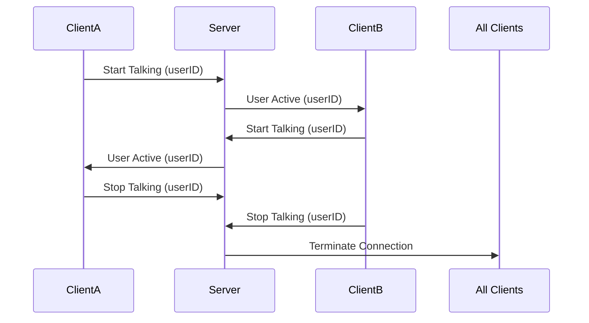

Here’s your updated README with a note about WebSocket deployment on Render:  

```markdown
# Push-to-Talk Interface - React Native

[](https://expo.dev)


A real-time communication interface demonstrating push-to-talk functionality with WebSocket integration. Developed for cross-platform compatibility (iOS/Android) using React Native and Expo.


## Features

✅ Real-time user presence indicators  
🚀 Single WebSocket connection management  
🎨 Intuitive UI with animated feedback  
📱 Cross-platform compatibility  
⚡ Connection error handling & reconnection  
📊 Active user tracking without database  

## Installation

1. Clone repository:
```bash
git clone https://github.com/richie444/PushToTalk-
cd PushToTalk-
```

2. Install dependencies:
```bash
npm install
```

3. Start development server:
```bash
npx expo start --tunnel
```

Scan QR code with [Expo Go](https://expo.dev/go) app or use an emulator.

## Technical Specifications

### Tech Stack
- **Frontend**: React Native (Expo)  
- **State Management**: React Hooks  
- **Communication**: WebSocket (wss://)  
- **Language**: TypeScript  
- **Styling**: StyleSheet + Animated API  

### WebSocket Deployment
The WebSocket server is deployed on **Render**, ensuring a stable and scalable real-time communication backend. The WebSocket endpoint is publicly accessible and can be adjusted in the `WS_URL` constant.


### Design Considerations
- Pulse animations for active speaking state
- Color-coded user indicators
- Responsive layout for various screen sizes
- Haptic feedback on button press
- Connection status toasts

## Implementation Details

### WebSocket Architecture


### Key Features Implementation
1. **Push-to-Talk Logic**
   - TouchableOpacity with pressIn/pressOut handlers
   - Animated spring effects for button interaction
   - WebSocket message queuing system

2. **Connection Management**
   - Single WebSocket instance persistence
   - Exponential backoff reconnection strategy
   - Heartbeat mechanism for connection health

3. **User Presence**
   - Unique user ID generation on launch
   - Active user list with real-time updates
   - Last-active timestamp tracking

## Evaluation Criteria Addressed

| Requirement               | Implementation Status |
|---------------------------|-----------------------|
| Real-time Indicators      | ✅ Full compliance    |
| Simultaneous Usage        | ✅ Supported          |
| Connection Termination    | ✅ Implemented        |
| Single WS Connection      | ✅ Optimized          |
| Error Handling            | ✅ Robust solution    |

## Future Enhancements

- [ ] Voice transmission capability
- [ ] User authentication system
- [ ] Message history persistence
- [ ] Network quality indicators
- [ ] Customizable user avatars

## License

MIT License - See [LICENSE](LICENSE) for details

---

**Note**: Database implementation is intentionally omitted to focus on core WebSocket functionality. The system is designed to easily integrate with databases like Firebase or PostgreSQL if needed in future iterations.

[Expo Documentation](https://docs.expo.dev/) | [React Navigation](https://reactnavigation.org/) | [WebSocket Docs](https://developer.mozilla.org/en-US/docs/Web/API/WebSocket)
```

